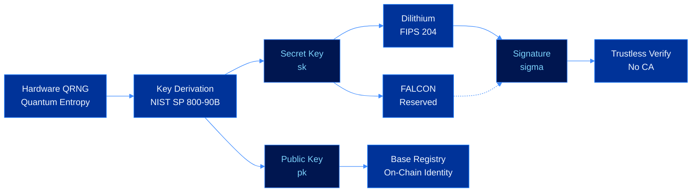
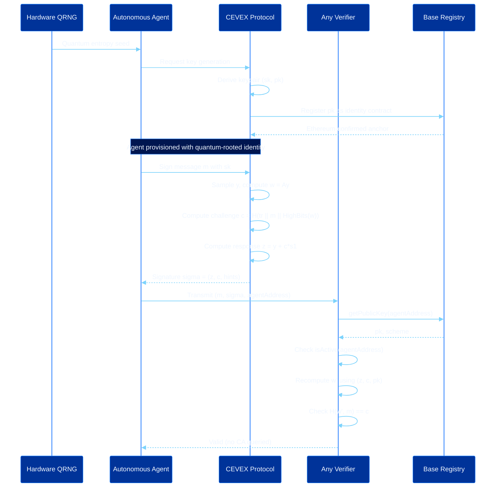

<div align="center">

<br/>

# CEVEX

**Post-quantum cryptographic identity infrastructure for autonomous AI agents**

Built for Base. Secured beyond classical limits.

<br/>


<br/>

</div>

---

## What is CEVEX?

As autonomous agents proliferate across financial, logistical, and computational networks, the absence of verifiable identity introduces systemic risk at civilizational scale. Classical public key infrastructure relies on computational hardness assumptions that fault-tolerant quantum computers will render obsolete within a predictable horizon.

CEVEX addresses this through the convergence of three primitives:

- **Quantum-rooted entropy** using the hardware QRNG interface or local development entropy, with SHAKE-256 conditioning before key derivation
- **Post-quantum lattice signatures** using CRYSTALS-Dilithium as the active signing path, with FALCON reserved as the secondary NIST scheme for the audited release path
- **Decentralized registry design** for Base, giving each agent identity Ethereum-secured finality and a trustless verification path that does not require certificate authorities

---

## Protocol Architecture



---

## Signing and Verification Flow



---

## Protocol Stack

| Layer | Component | Specification | Status |
|-------|-----------|---------------|--------|
| Entropy | Hardware QRNG interface and development entropy | SHAKE-256 conditioning | Implemented |
| Entropy Compliance | NIST SP 800-90B profile | RCT and APT health checks | Specified |
| Key Derivation | Quantum-seeded KDF | Deterministic derivation from conditioned seed | Implemented |
| Primary Signing | CRYSTALS-Dilithium | NIST FIPS 204, ML-DSA family | Implemented |
| Secondary Signing | FALCON | NIST FIPS 206, FN-DSA family | Reserved interface |
| Security Assumption | Module LWE | Reduction to M-LWE hardness | Implemented |
| Verification | Trustless lattice arithmetic | No certificate authority required | Implemented |
| Batch Verification | Parallel verifier surface | Parallel local checks | Implemented |
| Registry | Base smart contract source | Append-only identity records | Source ready |
| SDK | Developer tooling | TypeScript packages and Python parity path | Active build |
| CLI | Terminal tooling | Provision, sign, verify, rotate, revoke, inspect | Implemented |
| Examples | Local protocol validation | Keygen, signing, verification, tamper rejection | Implemented |

---

## Repository Structure

```
cevex/
├── docs/              Protocol documentation and formal specifications
├── contracts/         Base smart contracts for the on-chain identity registry
├── sdk/               TypeScript and Python SDK
│   ├── packages/      @cevex/core, @cevex/agent, @cevex/verify, @cevex/registry
│   └── python/        cevex Python package
└── cli/               Command-line tool for agent provisioning
```

---

## Documentation

| Document | Description |
|----------|-------------|
| [Protocol Overview](docs/overview.md) | High-level explanation of the CEVEX protocol |
| [Key Generation](docs/key-generation.md) | Quantum entropy sourcing and key derivation |
| [Post-Quantum Signatures](docs/signatures.md) | Dilithium implementation and FALCON release path |
| [Trustless Verification](docs/verification.md) | Verification without trusted parties |
| [On-Chain Registry](docs/on-chain-registry.md) | Base smart contract identity layer |
| [Security Model](docs/security-model.md) | Threat model and formal security properties |
| [Cryptographic Primitives](docs/cryptographic-primitives.md) | Formal mathematics underlying the protocol |

---

## SDK Quick Start

```typescript
import { CevexAgent, CevexVerifier } from '@cevex/sdk'

const agent = await CevexAgent.provision({
  entropySource: 'software',
  scheme: 'dilithium3',
  network: 'base-sepolia'
})

const signed = await agent.sign({ action: 'transfer', amount: '100' })

const verifier = new CevexVerifier({ network: 'base-sepolia' })
const result = await verifier.verify(signed)
// { valid: true, active: true, scheme: 'dilithium3' }
```

```python
from cevex import CevexAgent, CevexVerifier

agent = await CevexAgent.provision(
    entropy_source="software",
    scheme="dilithium3",
    network="base-sepolia"
)
signed = await agent.sign({"action": "transfer", "amount": "100"})
result = await CevexVerifier(network="base-sepolia").verify(signed)
```

See [sdk/README.md](sdk/README.md) for full documentation.

---

## Roadmap

- [x] Quantum-conditioned key generation
- [x] CRYSTALS-Dilithium signing and verification
- [x] Local tamper rejection demo
- [x] Batch verification surface
- [x] Base registry smart contract source
- [x] TypeScript SDK package structure
- [x] CLI command surface
- [ ] Canonical Base deployment addresses
- [ ] FALCON audited implementation
- [ ] Python SDK parity
- [ ] ZK audit transcript tooling
- [ ] Cross-chain registry bridges

---

## Contact

Website: [cevex.io](https://cevex.io)
X: [@cevex_io](https://x.com/cevex_io)
Email: contact@cevex.io

---

<div align="center">
<sub>All rights reserved. CEVEX Protocol</sub>
</div>
