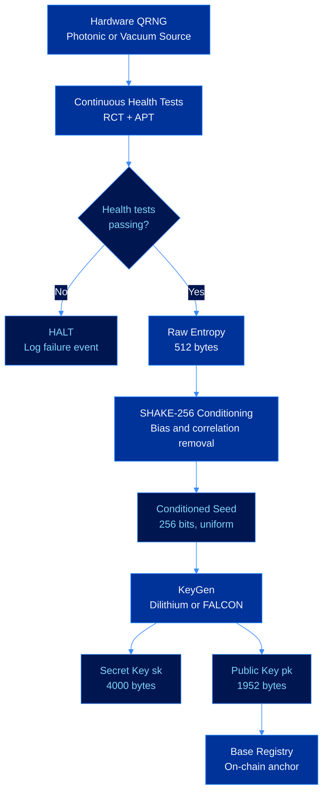

# Key Generation

CEVEX agent identities are derived from hardware quantum entropy. This document covers the physical basis of that entropy, the compliance requirements that govern it, and the derivation process that produces a usable cryptographic keypair.

---

## Why Quantum Entropy

Standard key generation relies on pseudorandom number generators. A PRNG is a deterministic algorithm: given the same seed, it produces the same output. Given partial knowledge of the internal state, the future output can be narrowed down. This is a structural property of all deterministic systems, not a flaw in any particular implementation.

Quantum random number generators break this chain. A QRNG measures a physical process whose outcome is fundamentally nondeterministic. The randomness is not an artifact of a complex algorithm. It is a property of nature.

---

## Entropy Pipeline

---

## Physical Entropy Sources

### Photonic Measurement

A photon directed at a 50/50 beamsplitter will be transmitted or reflected with equal probability. The outcome of each individual measurement cannot be predicted even with perfect knowledge of all prior measurements and all physical parameters. Photonic QRNGs typically achieve throughput of hundreds of megabits per second with min-entropy density approaching 1 bit per bit of output.

### Vacuum State Fluctuation

Vacuum state QRNGs measure the electric field quadrature of the quantum vacuum. Even in the absence of any photons, quantum field theory requires that the electromagnetic vacuum exhibits nonzero fluctuations with a Gaussian distribution. Homodyne detection of these fluctuations produces a high-bandwidth source of quantum randomness robust against photon number attacks.

---

## NIST SP 800-90B Compliance

All CEVEX entropy sources are validated against NIST Special Publication 800-90B. The core requirement is that the entropy source produces output with sufficient min-entropy per sample:

$$H_\infty(X) = -\log_2 \max_x \Pr[X = x]$$

CEVEX entropy sources target a min-entropy rate of at least $0.99$ bits per bit of output.

### Health Testing

Two mandatory tests run continuously during QRNG operation:

**Repetition Count Test (RCT):** Detects catastrophic failures where the generator outputs a constant value. If the same sample appears $C$ consecutive times where $C = \lceil -\log_2(\alpha) / \hat{H} \rceil + 1$, generation halts.

**Adaptive Proportion Test (APT):** Detects subtler entropy degradation over a window of $W = 512$ samples.

---

## Key Derivation

### Conditioning

Raw entropy is conditioned using SHAKE-256 before key derivation:

$$\text{seed} = \text{SHAKE-256}(r_1 \| r_2 \| \ldots \| r_n \| \text{context},\ 256)$$

The context string binds derivation to a specific agent provisioning event, preventing key reuse.

### Keypair Generation (Dilithium-3)

$$(\rho, \rho', K) = H(\text{seed}) \quad \rho, \rho', K \in \{0,1\}^{256}$$
$$\mathbf{A} = \text{ExpandA}(\rho) \in R_q^{k \times l}$$
$$(\mathbf{s}_1, \mathbf{s}_2) = \text{ExpandS}(\rho') \in S_\eta^l \times S_\eta^k$$
$$\mathbf{t} = \mathbf{A}\mathbf{s}_1 + \mathbf{s}_2$$
$$\text{pk} = (\rho,\ \mathbf{t}_1) \qquad \text{sk} = (\rho,\ K,\ \text{tr},\ \mathbf{s}_1,\ \mathbf{s}_2,\ \mathbf{t}_0)$$

---

## Parameter Sets

| Level | $(k, l)$ | pk size | sk size | sig size | Post-quantum security |
|-------|----------|---------|---------|----------|-----------------------|
| CEVEX-2 | (4, 4) | 1312 B | 2528 B | 2420 B | 128 bits |
| CEVEX-3 | (6, 5) | 1952 B | 4000 B | 3293 B | 162 bits |
| CEVEX-5 | (8, 7) | 2592 B | 4864 B | 4595 B | 256 bits |

Default deployment uses CEVEX-3.

---

## See Also

- [Post-Quantum Signatures](signatures.md)
- [On-Chain Registry](on-chain-registry.md)
- [Cryptographic Primitives](cryptographic-primitives.md)
