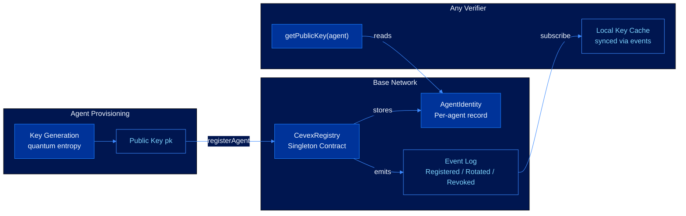
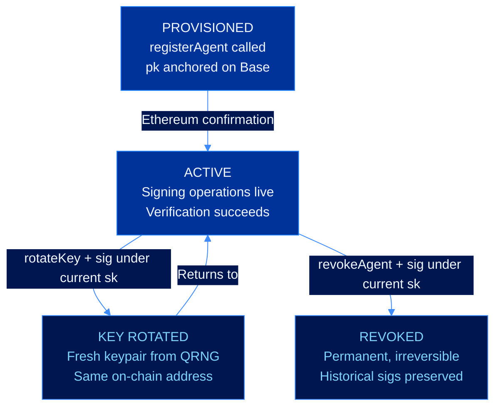

# On-Chain Registry

CEVEX agent identities are designed to be anchored on Base through an immutable registry contract. The repository includes the registry source, interface, and client integration path for a decentralized, append-only record of provisioned agent public keys.

---

## Current Status

| Component | Status |
|---|---|
| `CevexRegistry.sol` | Live on Base Sepolia |
| Registry interface | Implemented |
| TypeScript registry client | Live Base Sepolia address configured |
| Base Sepolia registry address | `0x59b121Bde845DBcbaEf6441d7B989cBd9eE3496C` |
| Registry agent registration | Confirmed on-chain |
| Public key lookup flow | Implemented client surface |

---

## Live Testnet Deployment

| Network | Chain ID | Registry | Explorer |
|---|---:|---|---|
| Base Sepolia | 84532 | `0x59b121Bde845DBcbaEf6441d7B989cBd9eE3496C` | [Basescan](https://sepolia.basescan.org/address/0x59b121Bde845DBcbaEf6441d7B989cBd9eE3496C) |

Live registry agent registration:

| Field | Value |
|---|---|
| Agent | `0x6A596904Bd096FA91D280566182A7b2193aE3495` |
| Transaction | [`0xfaf247e436349c558f71c0c11e38e4c03de81a2fec83cc2b387999d18fcb8e78`](https://sepolia.basescan.org/tx/0xfaf247e436349c558f71c0c11e38e4c03de81a2fec83cc2b387999d18fcb8e78) |
| Public key | 1952-byte ML-DSA-65 public key |
| Status | Registered and active |

---

## Registry Architecture



---

## Identity Lifecycle



---

## Agent Address Derivation

Each agent identity maps to a deterministic on-chain address:

$$\text{agentAddress} = \text{keccak256}(\text{pk})[-20\text{ bytes}]$$

The same public key always produces the same address. Two agents with different public keys always have different addresses. The address is computable from the public key without querying the registry.

---

## Core Interface

```solidity
function registerAgent(
    bytes calldata publicKey,
    uint8 scheme,           // 0 = Dilithium, 1 = FALCON reserved
    uint8 securityLevel,    // 2, 3, or 5
    bytes32 metadataHash
) external returns (address agentAddress);

function rotateKey(
    address agentAddress,
    bytes calldata newPublicKey,
    bytes calldata rotationSignature
) external;

function revokeAgent(
    address agentAddress,
    bytes calldata revocationSignature
) external;

function getPublicKey(address agentAddress)
    external view returns (bytes memory publicKey, uint8 scheme);

function isActive(address agentAddress) external view returns (bool);
```

Full contract source: [contracts/CevexRegistry.sol](../contracts/CevexRegistry.sol)

---

## Base Network Rationale

**Ethereum security.** Base posts state roots to Ethereum L1. A deployed registry receives Ethereum-backed finality without L1 gas costs.

**EVM compatibility.** Any EVM library can query agent identities. No special tooling required.

**Transaction costs.** Agent registration costs under $0.01 at typical Base gas prices.

**No admin key.** The registry is immutable once deployed. No upgrade mechanism, no proxy pattern, no admin that can modify records.

---

## Reading the Registry

```typescript
import { createPublicClient, http } from 'viem'
import { base } from 'viem/chains'

const client = createPublicClient({ chain: base, transport: http() })

const { publicKey, scheme } = await client.readContract({
  address: CEVEX_REGISTRY_ADDRESS,
  abi: CEVEX_REGISTRY_ABI,
  functionName: 'getPublicKey',
  args: [agentAddress]
})
```

---

## See Also

- [Trustless Verification](verification.md)
- [Key Generation](key-generation.md)
- [Security Model](security-model.md)
- [CevexRegistry.sol](../contracts/CevexRegistry.sol)
