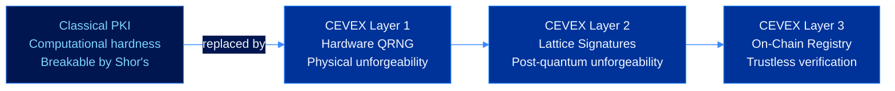
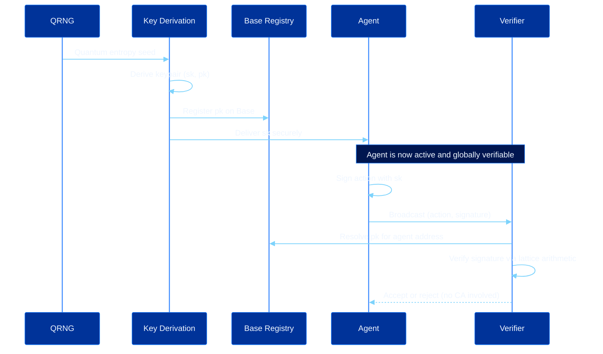

# Protocol Overview

CEVEX is post-quantum cryptographic identity infrastructure for autonomous AI agents. The protocol solves a coordination problem that emerges as machine economies proliferate beyond the reach of human supervision: how does any participant in a decentralized network verify that an action was performed by the agent it claims to originate from, without relying on a trusted intermediary, and without cryptographic assumptions that quantum hardware will soon invalidate?

---

## The Problem

Classical public key infrastructure rests on computational hardness assumptions. RSA relies on the difficulty of factoring large integers. ECDSA relies on the discrete logarithm problem over elliptic curves. A sufficiently powerful fault-tolerant quantum computer running Shor's algorithm solves both in polynomial time, collapsing the security of the entire classical identity stack.

For autonomous agent infrastructure, the threat is operational: compromised identity means unauthorized agents can execute transactions, accumulate resources, or trigger irreversible protocol decisions while appearing legitimate.

---

## The CEVEX Approach

CEVEX constructs a three-layer response.

**Layer 1: Physical Entropy.** Keys are derived from hardware quantum random number generation. Quantum measurement events are nondeterministic by physical law. An adversary with unbounded computational resources cannot predict or reproduce the entropy used to generate a CEVEX identity. This means identity uniqueness is bounded by physics, not mathematics.

**Layer 2: Post-Quantum Lattice Signatures.** Agent operations are authenticated using CRYSTALS-Dilithium today. The FALCON interface is reserved as the secondary NIST scheme for the audited release path. Security reduces to the hardness of Module LWE for the active signing path and NTRU lattice problems for the reserved secondary path.

**Layer 3: Decentralized On-Chain Registry.** Agent public keys are designed to be registered on Base through an append-only identity contract with Ethereum-secured finality. No certificate authority. No trusted third party. Any participant can verify implemented signatures through direct lattice arithmetic.

---

## Protocol Lifecycle

---

## Design Principles

**Physical unforgeability over algorithmic hardness.** Where possible, CEVEX replaces computational assumptions with physical guarantees. Quantum entropy is not assumed to be hard to predict, it is physically impossible to predict.

**No trust anchors.** Certificate authorities, OCSP responders, and trust anchors are single points of compromise that CEVEX eliminates by construction. Verification requires only public data and local computation.

**Long-horizon security.** Parameter sets are selected to maintain security through the 2080 cryptographic horizon based on NIST projections for fault-tolerant quantum hardware and lattice hardness estimates.

**Composability.** CEVEX signatures are standalone cryptographic artifacts. They can be embedded in zero-knowledge proofs, included in batch verification pipelines, or anchored to any EVM-compatible chain without modification to the core protocol.

---

## Relationship to Existing Standards

| Standard | Role in CEVEX |
|----------|---------------|
| NIST FIPS 204 | Dilithium signing scheme |
| NIST FIPS 206 | FALCON reserved secondary scheme |
| NIST SP 800-90B | Entropy source requirements for QRNG |
| NIST SP 800-208 | Key derivation guidance |

---

## Next Steps

- [Key Generation](key-generation.md)
- [Post-Quantum Signatures](signatures.md)
- [Trustless Verification](verification.md)
- [On-Chain Registry](on-chain-registry.md)
- [Security Model](security-model.md)
- [Cryptographic Primitives](cryptographic-primitives.md)
