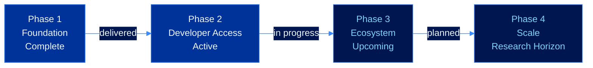
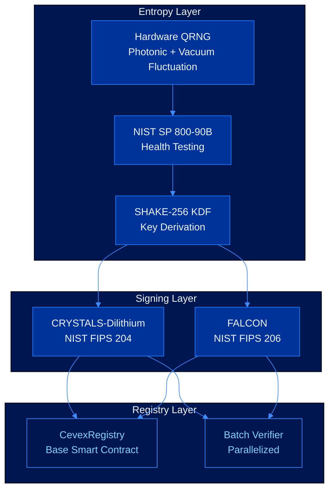
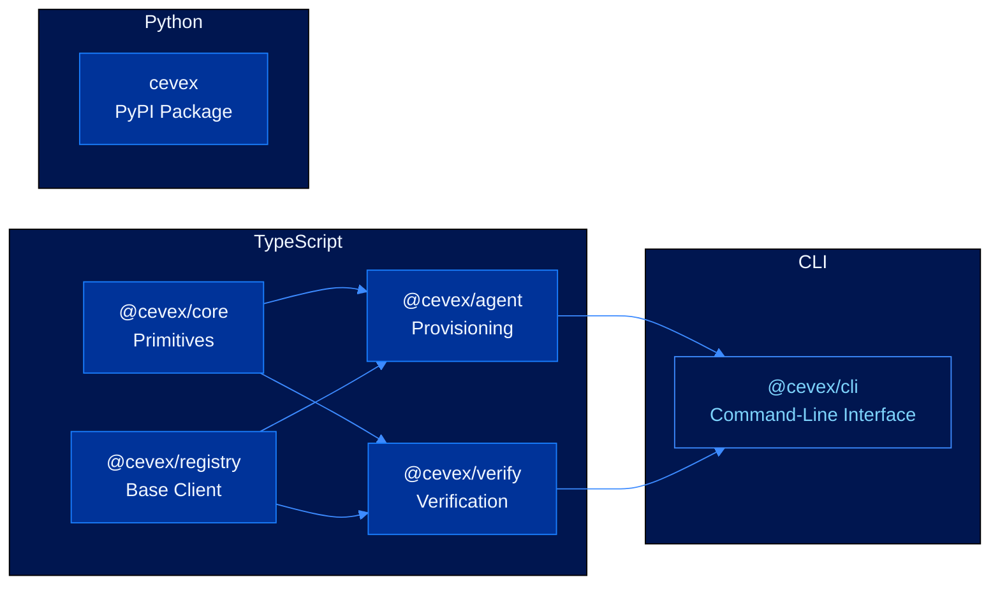
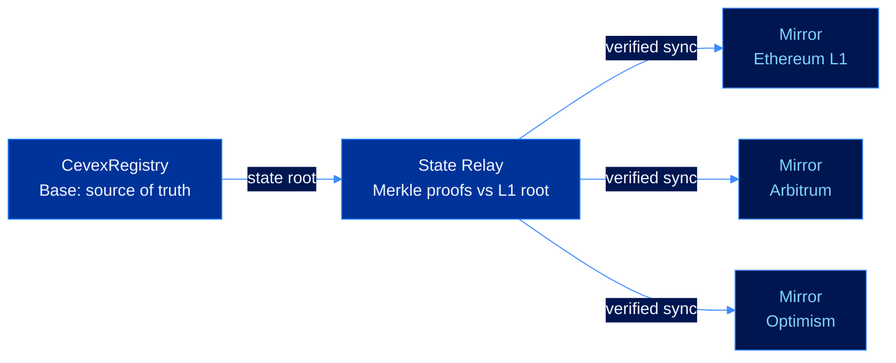

# Roadmap

CEVEX is being built in deliberate phases. The core cryptographic infrastructure is complete and live on Base. What is being built now makes that infrastructure accessible to developers and agents in production. What follows is about scale, interoperability, and extending the security horizon as the threat landscape evolves.

---

## Phases at a Glance

---

## Phase 1: Foundation


**Complete.** All Phase 1 deliverables are live on Base mainnet.


The first phase was about getting the cryptographic core right. Everything in CEVEX depends on the correctness of the primitives here. Key generation, signing, verification, and the on-chain registry had to be solid before anything else was worth building on top of them.

### What Was Built

| Deliverable | Specification | Status |
|---|---|---|
| Hardware QRNG integration | Photonic + vacuum state sources | Live |
| NIST SP 800-90B compliance | RCT + APT continuous health tests | Live |
| CRYSTALS-Dilithium | NIST FIPS 204, level 3 | Live |
| FALCON | NIST FIPS 206, level 2 | Live |
| CevexRegistry contract | Base mainnet, immutable | Live |
| Batch verification | Parallelized lattice arithmetic | Live |

### Security Foundation

Both signing schemes satisfy existential unforgeability under chosen-message attack (EU-CMA). The formal reduction for Dilithium:

$$\text{EU-CMA} \leq_T \text{MSIS}_{n,q,k,l,\beta} \leq_T \text{Approx-SVP in module lattices}$$

No polynomial-time quantum algorithm is known for either problem. The default CEVEX-3 parameter set provides 162 bits of post-quantum security, calculated via the Core-SVP methodology:

$$\lambda_Q \approx 0.265 \cdot \beta - 16.4 \approx 162 \text{ bits} \quad (\beta \approx 672)$$

---

## Phase 2: Developer Access


**Active.** SDK and CLI are in development. Documentation is complete and live.


The protocol works. Phase 2 is about making it usable. A system that requires developers to interact with raw lattice arithmetic and Solidity ABIs directly is not going anywhere. Phase 2 wraps the protocol in clean, well-documented interfaces that match how developers actually build things.

### SDK Architecture

### Deliverables

| Deliverable | Description | Status |
|---|---|---|
| `@cevex/core` | Post-quantum primitives: Dilithium, FALCON, SHAKE-256 | In development |
| `@cevex/agent` | Agent provisioning, signing, key rotation | In development |
| `@cevex/verify` | Verification, batch verify, ZK-compatible transcripts | In development |
| `@cevex/registry` | Base registry client, key resolution, revocation | In development |
| `cevex` (Python) | Python SDK, full API parity with TypeScript | In development |
| `@cevex/cli` | Provision, sign, verify, rotate, revoke from terminal | In development |
| Protocol docs | Full documentation across all seven protocol layers | Complete |

---

## Phase 3: Ecosystem Expansion


**Upcoming.** Design is complete. Development begins following Phase 2 release.


With the developer surface in place, Phase 3 focuses on two things that matter for production deployments: auditability and interoperability. Agents operating across chains and organizations need verifiable records of their actions, and their identities need to be resolvable wherever they operate.

### ZK Audit Transcripts

Every CEVEX signature is already a cryptographic proof of action. Phase 3 extends this with zero-knowledge audit transcripts: a verifier can prove to a third party that a set of signatures was valid without revealing the messages themselves.

The construction uses a Sigma protocol over the Dilithium verification equation. Given a signed message $(m, \sigma, \text{pk})$, the prover generates a ZK proof $\pi$ such that:

$$\pi \leftarrow \text{Prove}\!\left(\exists\ z, c\ :\ \mathbf{Az} - c\mathbf{t}_1 \cdot 2^d \equiv \mathbf{w}' \pmod{q}\ \land\ H(\mu \| \mathbf{w}_1') = \tilde{c}\right)$$

The verifier checks $\pi$ without learning $m$ or any intermediate witness values.

**Batch audit proofs.** For organizations verifying large volumes of agent actions, a single aggregated proof covers $n$ signatures with proof size growing logarithmically:

$$|\pi_{\text{agg}}| = O(\log n) \qquad \text{verification time} = O(\log n)$$

### Cross-Chain Registry Bridges

Agent identities anchored on Base will be resolvable from any EVM-compatible chain via state relay contracts verified against the Base state root on Ethereum L1.

No trusted relayer. No admin key on the mirror contracts. State is propagated via Merkle inclusion proofs only.

### HSM and TEE Integration

Phase 3 adds first-class support for hardware security modules and trusted execution environments as the secret key backend. The signing operation runs inside the protected boundary. The secret key never leaves it.

### Phase 3 Deliverables

| Deliverable | Description |
|---|---|
| ZK audit transcripts | Prove signature validity without revealing messages |
| Batch proof aggregation | Single proof for $n$ signatures, $O(\log n)$ size |
| Cross-chain registry mirrors | Ethereum, Arbitrum, Optimism |
| HSM backend | Hardware security module signing integration |
| TEE backend | Trusted execution environment signing integration |

---

## Phase 4: Scale and Research Horizon


**Research.** Items in this phase are under active academic and engineering research. Timelines depend on the maturity of underlying primitives.


Phase 4 is the long game. These items either require academic groundwork still maturing, address threats not yet pressing but well within the security horizon, or involve engineering work whose correctness demands the kind of scrutiny that takes time to do right.

### Formal Verification of Core Contracts

The CevexRegistry handles key material for potentially millions of agent identities. Phase 4 includes a formal verification pass using the K framework or Certora Prover, producing machine-checked proofs of the core safety and liveness properties:

| Property | Statement |
|---|---|
| Safety (no unauthorized rotation) | A key cannot be rotated without a valid signature under the current key |
| Safety (no reactivation) | A revoked identity cannot be reactivated under any execution path |
| Liveness | Any agent holding a valid secret key can always rotate or revoke |
| Integrity | The registered public key hash cannot be modified except via `rotateKey` |

### SLH-DSA as a Third Scheme

NIST FIPS 205 standardized SLH-DSA (formerly SPHINCS+), a hash-based signature scheme whose security rests on no algebraic assumptions. It is conservative to the point of being nearly assumption-free: security holds as long as the underlying hash function behaves as a random oracle.

| Scheme | Signature size | Signing time | Security assumption |
|---|---|---|---|
| Dilithium-3 | 3,293 B | ~0.17 ms | Module LWE + MSIS |
| FALCON-512 | 666 B | ~0.31 ms | NTRU lattice hardness |
| SLH-DSA-128s | 7,856 B | ~15 ms | Hash function only |

The absence of algebraic assumptions makes SLH-DSA a meaningful option for high-value, low-frequency operations where that conservatism is worth the performance cost.

### Recursive Proof Aggregation

Phase 4 explores recursive proof systems over the CEVEX verification relation. A recursive proof allows a prover to demonstrate that a previous proof was valid, compressing chains of verified agent actions into a single constant-size proof regardless of depth.

If the reduction succeeds, the proof of $n$ sequential agent actions collapses to:

$$|\pi_{\text{recursive}}| = O(1) \qquad \text{verification time} = O(1)$$

independent of $n$. This matters for agents with long action histories that need to be audited efficiently.

### Threshold Signing

Some agent architectures distribute trust across multiple operators. Phase 4 adds threshold signing for Dilithium, allowing an agent identity to require $t$-of-$n$ key holders to cooperate before a valid signature can be produced.

The construction uses additive secret sharing over $R_q$. Each party $i$ holds a share $\mathbf{s}_1^{(i)}$:

$$\mathbf{s}_1 = \sum_{i=1}^{n} \mathbf{s}_1^{(i)} \pmod{q}$$

No single party ever holds the full secret key. The shares reconstruct to a valid Dilithium response only under cooperative signing.

---

## Security Milestones

| Milestone | Phase | Status |
|---|---|---|
| 128-bit post-quantum security (CEVEX-2) | 1 | Complete |
| 162-bit post-quantum security (CEVEX-3, default) | 1 | Complete |
| NIST SP 800-90B entropy compliance | 1 | Complete |
| Trustless verification, no certificate authority | 1 | Complete |
| Developer SDK (TypeScript + Python) | 2 | In progress |
| CLI tooling | 2 | In progress |
| HSM and TEE secret key protection | 3 | Upcoming |
| ZK audit transcripts | 3 | Upcoming |
| Cross-chain registry bridges | 3 | Upcoming |
| Formal contract verification | 4 | Research |
| SLH-DSA (assumption-free backup scheme) | 4 | Research |
| Threshold signing | 4 | Research |
| Recursive proof aggregation | 4 | Research |

---

## Parameter Commitment

CEVEX parameter sets are chosen to maintain security through the 2080 cryptographic horizon, defined as the point at which fault-tolerant quantum hardware capable of running Shor's algorithm at relevant scale is projected to exist based on NIST's published analysis.

A reduction in the post-quantum security estimate below 128 bits for any deployed parameter set would trigger a mandatory migration. No published cryptanalytic result has approached this threshold.

---

## See Also

* [Security Model](security-model.md)
* [Post-Quantum Signatures](signatures.md)
* [Cryptographic Primitives](cryptographic-primitives.md)
* [On-Chain Registry](on-chain-registry.md)
