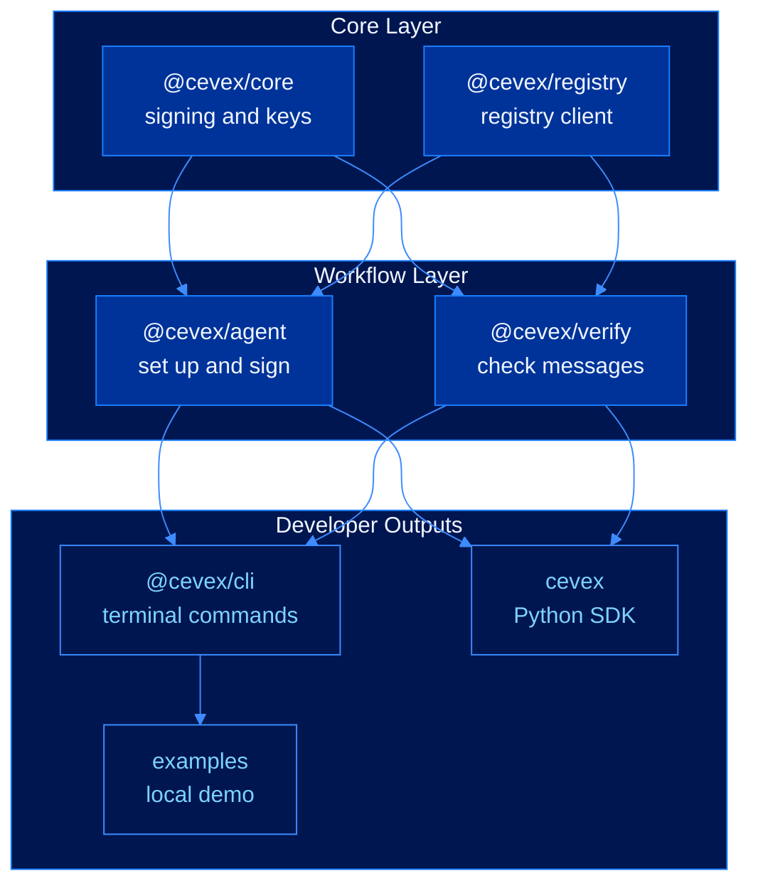
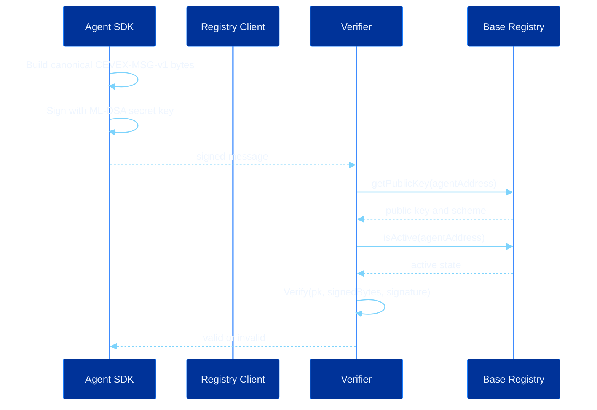

# Phase 2: Developer Tools


**Developer tools are active.** SDK packages, the CLI surface, the local demo, and GitBook reference are available in the repository.


This phase turns the core identity system into tools people can actually use. Developers can create an agent identity, sign an action, verify a message, and inspect registry state without needing to understand the cryptography internals first.

---

## Developer Surface



---

## Current Deliverables

| Deliverable | Purpose | Status |
|---|---|---|
| `@cevex/core` | Core signing, key, and entropy utilities | Implemented |
| `@cevex/agent` | Agent setup, signing, rotation, and revocation surface | Implemented |
| `@cevex/verify` | Single and batch message verification | Implemented |
| `@cevex/registry` | Base registry lookup and write helpers | Live Base Sepolia address |
| `@cevex/cli` | Terminal commands for the main workflows | Implemented |
| `cevex` Python | Python SDK matching the TypeScript shape | Active build |
| Examples | Local demo for onboarding and validation | Implemented |
| GitBook docs | Public reference for users and developers | Live |

---

## Message Validation Path



---

## Message Format

Every SDK implementation turns a signed action into the same byte format before signing. This keeps messages consistent across apps and prevents replay or cross-use mistakes.

```text
CEVEX-MSG-v1 ||
version:uint8 ||
agentAddress:bytes20 ||
nonce:uint64be ||
timestamp:uint64be ||
actionLength:uint32be ||
action:bytes
```

The signature relation is:

$$\sigma \leftarrow \text{Sign}_{sk}\!\left(\text{Encode}_{\text{CEVEX-MSG-v1}}(m)\right)$$

Verification accepts only if:

$$\text{Verify}_{pk}\!\left(\text{Encode}_{\text{CEVEX-MSG-v1}}(m),\sigma\right)=1$$

---

## Acceptance Criteria

| Area | Requirement |
|---|---|
| SDK | Deterministic message encoding across TypeScript and Python |
| CLI | End-to-end provision, sign, verify, rotate, revoke workflows |
| Registry | Configurable network, RPC URL, and registry address |
| Examples | Local keygen, signing, verification, tamper rejection, and JSON output |
| Security | Secret key material never printed in examples or logs |
| Documentation | All commands and API surfaces match implementation |

---

## Next

* [Phase 1: Core Identity](foundation.md)
* [Phase 3: Production Integrations](ecosystem-expansion.md)
* [Phase 4: Advanced Research](research-horizon.md)
