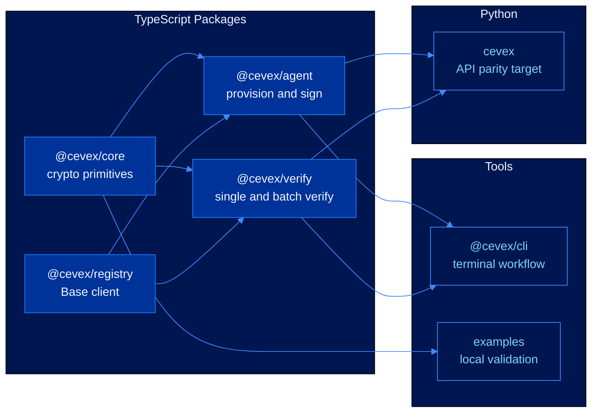
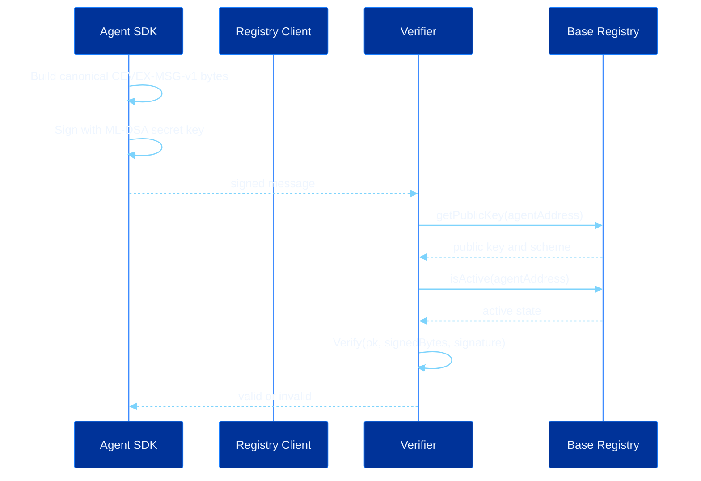

# Developer Access


**Active delivery.** The TypeScript packages, CLI surface, local validation demo, and GitBook reference are now available in the repository.


The protocol layer is useful only when developers can provision identities, sign actions, verify messages, and inspect registry state without handling raw lattice internals. Developer Access packages the CEVEX primitives into interfaces that are practical for agent operators and application teams.

---

## Developer Surface



---

## Current Deliverables

| Deliverable | Purpose | Status |
|---|---|---|
| `@cevex/core` | Dilithium, FALCON guarded interface, SHAKE-256, entropy types | Implemented |
| `@cevex/agent` | Provisioning, message signing, key rotation, revocation surface | Implemented |
| `@cevex/verify` | Single verification, batch verification, transcript interface | Implemented |
| `@cevex/registry` | Base RPC client, identity lookup, registry writes | Source ready |
| `@cevex/cli` | Provision, sign, verify, rotate, revoke, inspect | Implemented |
| `cevex` Python | Python SDK with TypeScript API parity | Active build |
| Examples | Local protocol validation and developer onboarding | Implemented |
| GitBook docs | Public protocol and integration reference | Live |

---

## Message Validation Path



---

## Canonical Bytes

Every SDK implementation must produce the same byte sequence before signing:

```text
CEVEX-MSG-v1 ||
version:uint8 ||
agentAddress:bytes20 ||
nonce:uint64be ||
timestamp:uint64be ||
actionLength:uint32be ||
action:bytes
```

The signature relation is:

$$\sigma \leftarrow \text{Sign}_{sk}\!\left(\text{Encode}_{\text{CEVEX-MSG-v1}}(m)\right)$$

Verification accepts only if:

$$\text{Verify}_{pk}\!\left(\text{Encode}_{\text{CEVEX-MSG-v1}}(m),\sigma\right)=1$$

---

## Acceptance Criteria

| Area | Requirement |
|---|---|
| SDK | Deterministic message encoding across TypeScript and Python |
| CLI | End-to-end provision, sign, verify, rotate, revoke workflows |
| Registry | Configurable network, RPC URL, and registry address |
| Examples | Local keygen, signing, verification, tamper rejection, and JSON output |
| Security | Secret key material never printed in examples or logs |
| Documentation | All commands and API surfaces match implementation |

---

## Next

* [Foundation](foundation.md)
* [Ecosystem Expansion](ecosystem-expansion.md)
* [Research Horizon](research-horizon.md)
