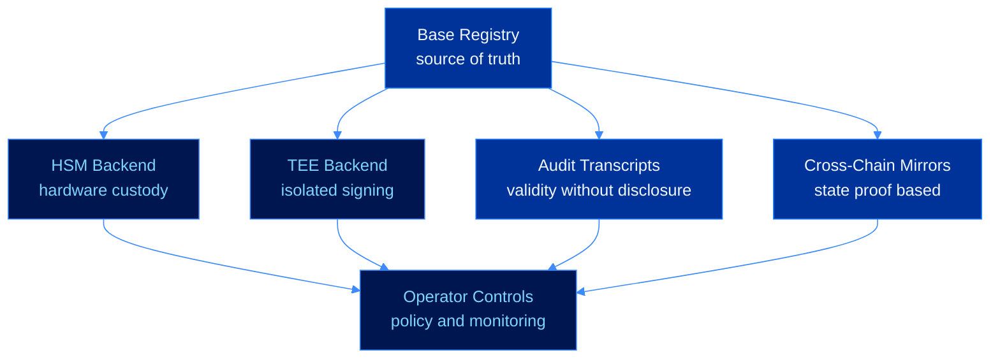
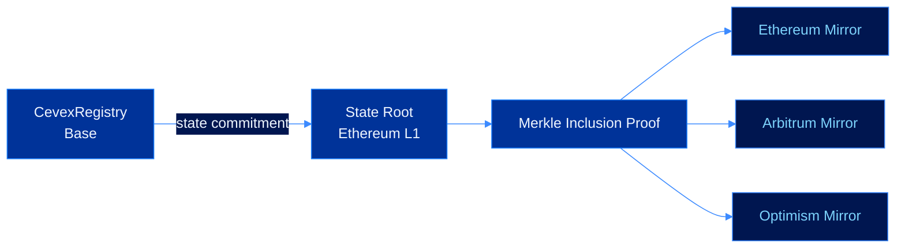

# Phase 3: Ecosystem Expansion


**Upcoming.** Ecosystem work begins after the developer access release hardens the SDK, CLI, and registry client.


Ecosystem Expansion extends CEVEX from single-agent verification into production environments that need audit trails, cross-chain identity resolution, hardware-backed custody, and organizational controls.

---

## Expansion Map

---

## ZK Audit Transcripts

A CEVEX signature proves that an agent authorized a message. Audit transcripts extend this by allowing a verifier to prove that a set of signatures was valid without revealing each message.

For a signed message $(m,\sigma,pk)$, the proof target is:

$$\pi \leftarrow \text{Prove}\!\left(\exists z,c:\mathbf{Az}-c\mathbf{t}_1 2^d \equiv \mathbf{w}' \pmod q \land H(\mu\|\mathbf{w}'_1)=\tilde c\right)$$

For batch audit workflows:

$$|\pi_{\text{agg}}| = O(\log n)$$

$$T_{\text{verify}} = O(\log n)$$

---

## Cross-Chain Registry Mirrors

Mirrors resolve agent identities outside Base using verifiable state proofs. The design target is no trusted relayer, no mirror admin key, and no manual registry reconciliation.

---

## Hardware Backends

| Backend | Purpose | Target Behavior |
|---|---|---|
| HSM | Protect long-lived production signing keys | `Sign()` runs inside hardware boundary |
| TEE | Isolate signing inside trusted execution | Secret key remains sealed to enclave |
| Policy engine | Restrict allowed agent actions | Rejects unauthorized payloads before signing |
| Monitoring | Detect unexpected signing patterns | Emits alerts for policy drift |

---

## Delivery Targets

| Deliverable | Outcome |
|---|---|
| ZK audit transcripts | Validity proof without message disclosure |
| Batch proof aggregation | Efficient proof for high-volume agent activity |
| Cross-chain mirrors | Agent identity resolution beyond Base |
| HSM signer | Production key custody backend |
| TEE signer | Isolated signing backend for autonomous agents |
| Operator controls | Policy, monitoring, and emergency revocation workflows |

---

## Next

* [Phase 1: Foundation](foundation.md)
* [Phase 2: Developer Access](developer-access.md)
* [Phase 4: Research Horizon](research-horizon.md)
