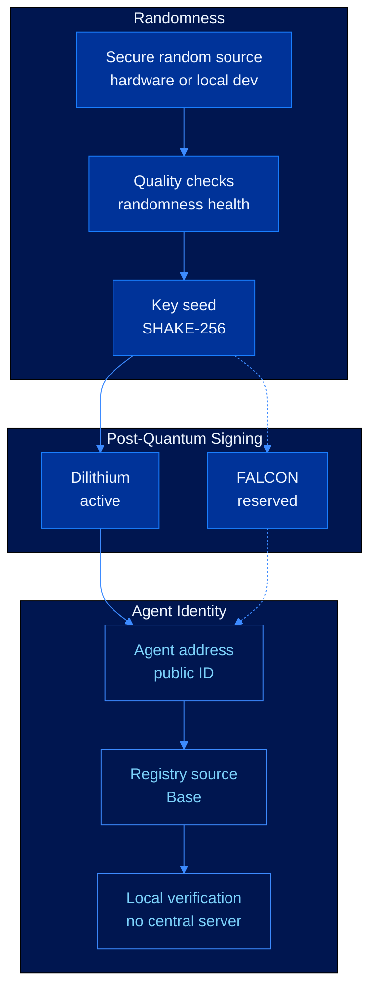

# Phase 1: Core Identity


**Core identity is in place.** The repository can create an agent key, sign a message, verify it locally, and prepare the registry record.


This phase proves the basic identity flow: an agent gets a secure key, signs an action, and any verifier can check that action without asking a central server. The deeper cryptography is still documented below for technical review.

---

## Core System



---

## Delivered Components

| Area | What it means | Status |
|---|---|---|
| Randomness source | Keys can be created from hardware entropy or local development entropy | Implemented |
| Randomness checks | Production entropy has a documented quality check model | Specified |
| Key creation | Randomness is turned into a post-quantum keypair | Implemented |
| Signing | Agents can sign messages with Dilithium | Implemented |
| Secondary scheme | FALCON stays reserved for a later audited release | Reserved |
| Agent address | Each public key maps to a stable agent ID | Implemented |
| Registry contract | Base registry source is available in the repo | Source ready |
| Verification | Signatures can be checked locally without a certificate authority | Implemented |

---

## Security Commitment

For technical readers, this phase commits CEVEX to post-quantum unforgeability under the standard lattice assumptions used by the selected NIST schemes.

For the default Dilithium parameter set:

$$\text{EU-CMA} \leq_T \text{MSIS}_{n,q,k,l,\beta} \leq_T \text{Approx-SVP}$$

The CEVEX-3 target follows the Core-SVP estimate:

$$\lambda_Q \approx 0.265 \cdot \beta - 16.4 \approx 162 \text{ bits} \quad (\beta \approx 672)$$

Any published reduction below the 128-bit post-quantum threshold triggers migration planning for active parameter sets.

---

## Registry Record

```solidity
struct AgentIdentity {
    bytes publicKey;
    uint8 scheme;
    uint8 securityLevel;
    uint64 registeredAt;
    uint64 revokedAt;
    bytes32 metadataHash;
}
```

The registry is append-only. A registered identity can rotate keys or become permanently revoked, but its historical record remains available for audit and verification.

---

## Exit Criteria

| Requirement | Result |
|---|---|
| Deterministic address derivation from post-quantum public keys | Satisfied |
| Public key storage without certificate authorities | Satisfied |
| Signature verification without trusted intermediaries | Satisfied |
| Revocation state represented by registry contract source | Satisfied |
| Security horizon documented through 2080 | Satisfied |

---

## Next

* [Phase 2: Developer Tools](developer-access.md)
* [Phase 3: Production Integrations](ecosystem-expansion.md)
* [Phase 4: Advanced Research](research-horizon.md)
