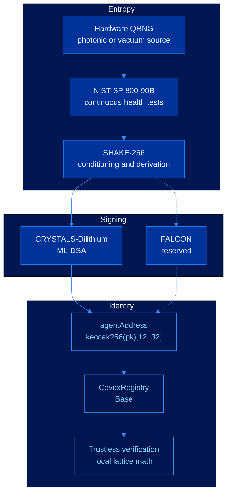

# Phase 1: Foundation


**Implemented foundation.** The Dilithium identity path, deterministic addressing model, and Base registry source are in place.


The foundation phase establishes the core CEVEX identity primitive: entropy rooted in quantum physical processes, post-quantum signing, deterministic agent addressing, and an append-only registry model. These pieces define the security model that every later developer tool builds on.

---

## Core System



---

## Delivered Components

| Component | Specification | Status |
|---|---|---|
| Entropy source | Hardware QRNG interface with local development entropy | Implemented |
| Health testing | NIST SP 800-90B RCT and APT checks | Specified |
| Key derivation | SHAKE-256 conditioned seed derivation | Implemented |
| Primary signature | CRYSTALS-Dilithium, NIST FIPS 204 | Implemented |
| Secondary signature | FALCON, NIST FIPS 206 | Reserved interface |
| Agent address | `address(uint160(uint256(keccak256(publicKey))))` | Implemented |
| Registry contract | Immutable Base registry source | Source ready |
| Verification path | Public key lookup plus local signature verification | Implemented |

---

## Security Commitment

The foundation phase commits CEVEX to post-quantum unforgeability under the standard lattice assumptions used by the selected NIST schemes.

For the default Dilithium parameter set:

$$\text{EU-CMA} \leq_T \text{MSIS}_{n,q,k,l,\beta} \leq_T \text{Approx-SVP}$$

The CEVEX-3 target follows the Core-SVP estimate:

$$\lambda_Q \approx 0.265 \cdot \beta - 16.4 \approx 162 \text{ bits} \quad (\beta \approx 672)$$

Any published reduction below the 128-bit post-quantum threshold triggers migration planning for active parameter sets.

---

## Registry Record

```solidity
struct AgentIdentity {
    bytes publicKey;
    uint8 scheme;
    uint8 securityLevel;
    uint64 registeredAt;
    uint64 revokedAt;
    bytes32 metadataHash;
}
```

The registry is append-only. A registered identity can rotate keys or become permanently revoked, but its historical record remains available for audit and verification.

---

## Exit Criteria

| Requirement | Result |
|---|---|
| Deterministic address derivation from post-quantum public keys | Satisfied |
| Public key storage without certificate authorities | Satisfied |
| Signature verification without trusted intermediaries | Satisfied |
| Revocation state represented by registry contract source | Satisfied |
| Security horizon documented through 2080 | Satisfied |

---

## Next

* [Phase 2: Developer Access](developer-access.md)
* [Phase 3: Ecosystem Expansion](ecosystem-expansion.md)
* [Phase 4: Research Horizon](research-horizon.md)
