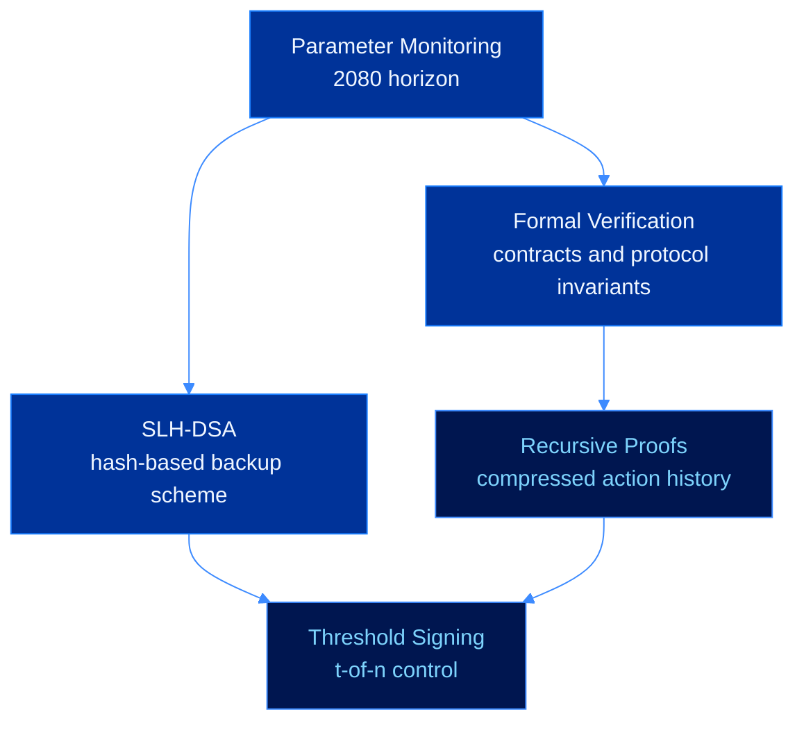

# Research Horizon


**Research.** These items extend the protocol beyond the immediate release path and depend on cryptographic maturity, implementation safety, and formal review.


The research horizon covers longer-range work where correctness matters more than speed of release. These items improve assurance, add conservative backup schemes, compress verification history, and support distributed control for high-value agents.

---

## Research Tracks

---

## Formal Verification

The CevexRegistry holds public keys, revocation state, and metadata commitments for agent identities. Formal verification targets machine-checked assurance for the registry invariants.

| Property | Statement |
|---|---|
| Registration uniqueness | A public key maps to one deterministic agent address |
| No unauthorized rotation | Key rotation requires authorization under the active key |
| No reactivation | A revoked identity cannot return to active status |
| Integrity | Public key state changes only through the rotation path |
| Liveness | A valid active agent can rotate or revoke when policy permits |

Candidate methods include K framework specifications, Certora Prover rules, and property-based Solidity tests.

---

## SLH-DSA Backup Scheme

SLH-DSA, formerly SPHINCS+, gives CEVEX a conservative hash-based fallback whose security does not rely on lattice assumptions.

| Scheme | Signature size | Signing profile | Security assumption |
|---|---:|---:|---|
| Dilithium-3 | 3,293 B | fast | Module LWE and MSIS |
| FALCON-512 | 666 B | fast | NTRU lattice hardness |
| SLH-DSA-128s | 7,856 B | slower | Hash function security |

SLH-DSA is best suited for high-value, low-frequency operations where conservative assumptions are worth the added size and signing cost.

---

## Recursive Proof Aggregation

Recursive proofs compress long action histories into a proof that remains small as the number of verified actions grows.

For a chain of $n$ valid agent actions:

$$\pi_i \leftarrow \text{Prove}\!\left(V(pk_i,m_i,\sigma_i)=1 \land \pi_{i-1}\text{ valid}\right)$$

The target compression profile is:

$$|\pi_{\text{recursive}}| = O(1)$$

$$T_{\text{verify}} = O(1)$$

This matters for long-running agents that need to provide compact audit evidence without replaying every historical signature.

---

## Threshold Signing

Threshold signing allows an agent identity to require $t$ of $n$ authorized parties before producing a valid signature. The design target is distributed control without any participant holding the full signing key.

The Dilithium secret vector can be shared additively over $R_q$:

$$\mathbf{s}_1 = \sum_{i=1}^{n}\mathbf{s}_1^{(i)} \pmod q$$

A valid signing response is produced only when enough shares participate:

$$|\{i : \mathbf{s}_1^{(i)} \text{ participates}\}| \geq t$$

---

## Research Milestones

| Milestone | Status |
|---|---|
| Formal registry specification | Research |
| Machine-checked safety proofs | Research |
| SLH-DSA integration study | Research |
| Recursive proof feasibility | Research |
| Threshold Dilithium design | Research |
| Parameter monitoring process | Ongoing |

---

## Next

* [Foundation](foundation.md)
* [Developer Access](developer-access.md)
* [Ecosystem Expansion](ecosystem-expansion.md)
