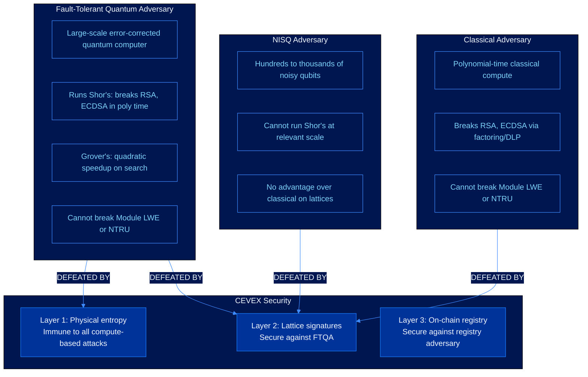

# Security Model

This document defines the threat model for CEVEX, the adversary classes the protocol is designed to resist, and the formal security properties that follow.

---

## Adversary Landscape

---

## Security Parameters and the Quantum Horizon

CEVEX uses parameter sets calibrated to remain secure through the 2080 cryptographic horizon, based on NIST's published analysis of fault-tolerant quantum hardware timelines.

### Module LWE Hardness Estimate

The post-quantum security of Dilithium-3 against the best known lattice attacks (BKZ with quantum speedup):

$$\lambda_Q \approx 0.265 \cdot \beta - 16.4$$

For the CEVEX-3 parameter set, $\beta \approx 672$, giving $\lambda_Q \approx 162$ bits of post-quantum security.

### Security Level Summary

| CEVEX Level | Classical Security | Post-Quantum Security | 2080 Safe |
|-------------|--------------------|-----------------------|-----------|
| CEVEX-2 | 128 bits | 128 bits | Marginal |
| CEVEX-3 | 192 bits | 162 bits | Yes |
| CEVEX-5 | 256 bits | 256 bits | Yes (conservative) |

---

## Formal Security Definitions

### EU-CMA (Existential Unforgeability under Chosen-Message Attack)

No probabilistic polynomial-time adversary $\mathcal{A}$ can produce a valid forgery $(m^*, \sigma^*)$ where $m^*$ was not previously queried to the signing oracle:

$$\Pr[\text{Verify}(\text{pk}, m^*, \sigma^*) = 1 \ \land \ m^* \notin \mathcal{Q}] \leq \text{negl}(\lambda)$$

Both Dilithium and FALCON satisfy EU-CMA under their respective hardness assumptions.

---

## CEVEX vs Classical PKI

| Property | Classical PKI | CEVEX |
|----------|---------------|-------|
| Quantum resistance | None (Shor's breaks ECDSA) | Full (lattice hardness) |
| Trust model | Hierarchical CA chain | Trustless on-chain arithmetic |
| Entropy source | PRNG (deterministic) | QRNG (physically nondeterministic) |
| Revocation | OCSP (online query required) | On-chain (permissionless read) |
| Single point of failure | CA compromise | None by construction |
| Long-horizon security | Broken by FTQA | Secure through 2080 |

---

## See Also

- [Cryptographic Primitives](cryptographic-primitives.md)
- [Key Generation](key-generation.md)
- [Trustless Verification](verification.md)
