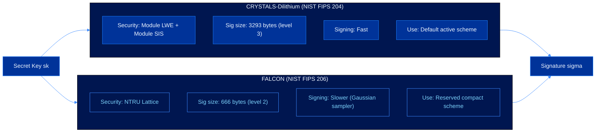
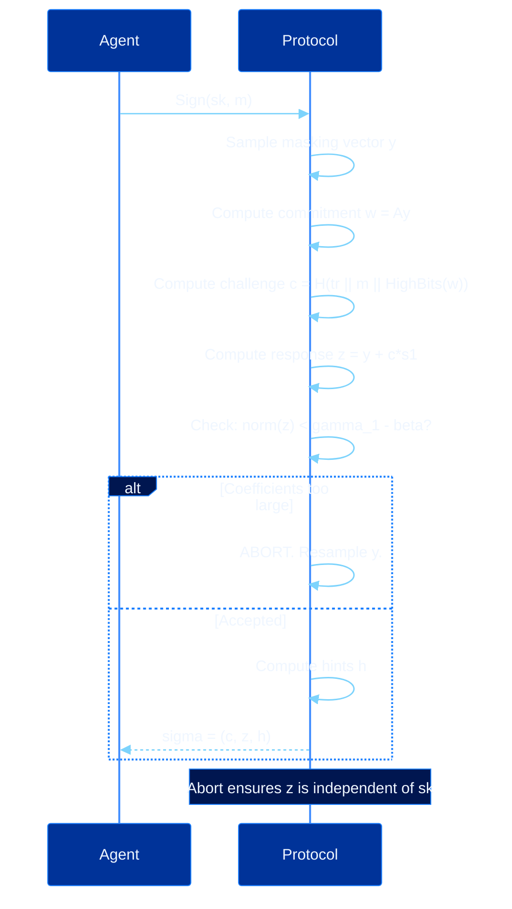

# Post-Quantum Signatures

CEVEX authenticates agent operations using post-quantum digital signature schemes. The active implementation path uses CRYSTALS-Dilithium. FALCON remains part of the protocol design as a reserved secondary scheme for a later audited release.

---

## Implementation Status

| Scheme | Standard | Role | Repository status |
|---|---|---|---|
| CRYSTALS-Dilithium | NIST FIPS 204, ML-DSA family | Default signing path | Implemented |
| FALCON | NIST FIPS 206, FN-DSA family | Compact secondary path | Reserved interface |

---

## Scheme Comparison

---

## CRYSTALS-Dilithium (NIST FIPS 204)

Dilithium is the primary signing scheme in CEVEX. Its security reduces to the hardness of Module LWE and Module SIS over polynomial rings.

### Signing Flow

The abort mechanism is the key security primitive. Accepted responses are statistically independent of the secret key, so an adversary observing many signatures learns nothing about $\mathbf{s}_1$.

### Verification

$$\mathbf{w}_1' = \text{UseHint}(\mathbf{h},\ \mathbf{A}\mathbf{z} - c\mathbf{t}_1 \cdot 2^d,\ 2\gamma_2)$$

Accept if $\tilde{c} = H(\mu \| \mathbf{w}_1')$ and $\|\mathbf{z}\|_\infty < \gamma_1 - \beta$.

---

## FALCON Release Path (NIST FIPS 206)

FALCON uses a different lattice structure: the NTRU lattice. Signing is equivalent to solving a closest vector problem using a trapdoor short basis. CEVEX keeps the public interface reserved so applications can understand the planned scheme boundary without treating it as the active signing path.

**Key generation:**

$$h = g \cdot f^{-1} \pmod{q}$$

where $f, g$ are short polynomials forming the trapdoor. The public key $h$ defines the NTRU lattice but reveals nothing about $f$ and $g$.

**Signing:**

$$\sigma = \text{SamplePre}(\mathbf{B},\ H(r \| m))$$

A Gaussian preimage is sampled over the lattice using the trapdoor basis.

**Verification:**

$$\mathbf{s}_1 + h \cdot \mathbf{s}_2 = H(r \| m) \pmod{q}$$

Check that $(\mathbf{s}_1, \mathbf{s}_2)$ is short and the equation holds.

---

## Reference Performance Profile

| Operation | Dilithium-3 | FALCON-512 |
|-----------|-------------|------------|
| Key generation | 0.12 ms | 8.2 ms |
| Signing | 0.17 ms | 0.31 ms |
| Verification | 0.10 ms | 0.09 ms |
| Signatures per second | ~5,800 | ~3,200 |
| Signature size | 3293 B | 666 B |

The active developer path should use Dilithium. FALCON's smaller signatures remain valuable for high-frequency agents where calldata size matters, subject to a production-ready implementation and review.

---

## Replay Protection

All CEVEX signatures include a nonce bound to the specific message via a domain separation prefix:

$$\sigma = \text{Sign}(sk,\ \text{"CEVEX-MSG-v1"} \| \text{agentAddr} \| \text{nonce} \| \text{timestamp} \| \text{action})$$

A valid signature on message $m$ cannot be reused for any other message. High-frequency agents can sign at machine speed without coordination overhead.

---

## See Also

- [Key Generation](key-generation.md)
- [Trustless Verification](verification.md)
- [Cryptographic Primitives](cryptographic-primitives.md)
