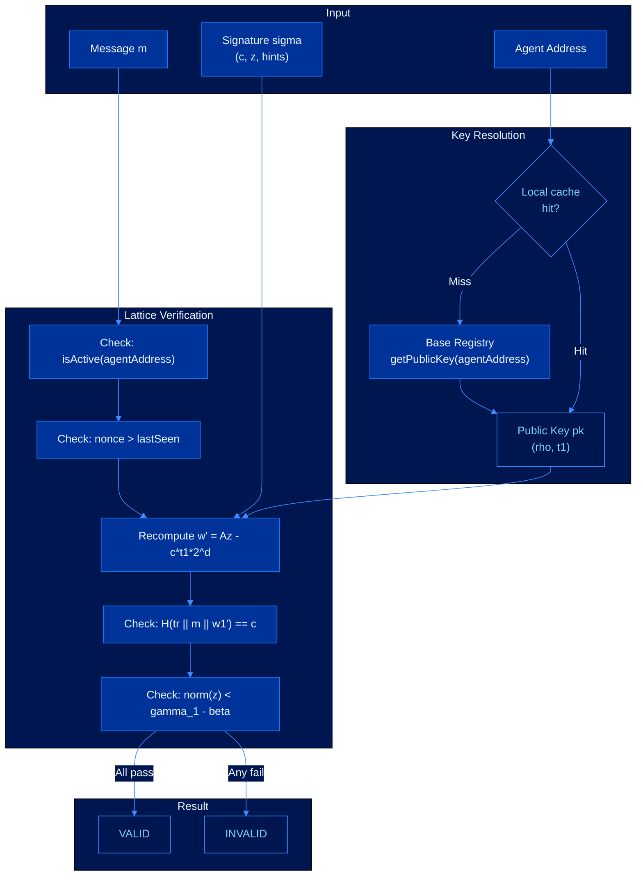
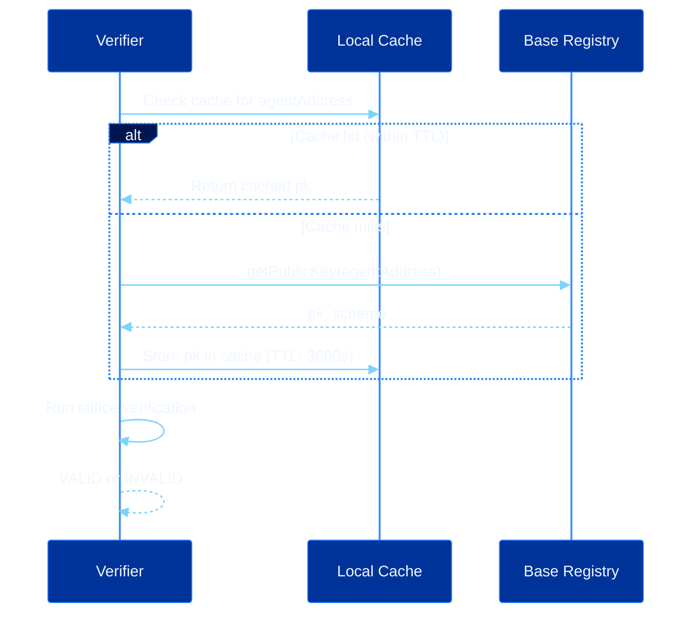

# Trustless Verification

CEVEX signatures can be verified by any participant in the network using only public information. No certificate authority, trust anchor, online service, or trusted third party is required at any point in the verification path.

---

## Verification Architecture

---

## Public Key Resolution

In steady-state operation, verification requires zero network round trips. The verifier holds cached public keys, receives the message and signature, and performs local lattice arithmetic.

---

## Batch Verification

For scenarios where a verifier must check many signatures at once, CEVEX supports batch verification using a randomized linear combination:

$$\sum_{i=1}^{n} r_i \cdot \text{VerifyEq}_i = 0$$

where $r_i$ are freshly sampled random coefficients. If all $n$ signatures are valid, the sum is zero with overwhelming probability.

| Batch Size | Sequential (ms) | Batch (ms) | Speedup |
|------------|-----------------|------------|---------|
| 8 | 0.80 | 0.52 | 1.5x |
| 64 | 6.40 | 3.10 | 2.1x |
| 512 | 51.2 | 18.4 | 2.8x |
| 4096 | 409.6 | 112.0 | 3.7x |

---

## Security Properties

| Property | Description |
|----------|-------------|
| Completeness | A valid signature always passes verification |
| Soundness | An invalid signature passes with probability at most $2^{-\lambda}$ |
| Zero-knowledge | Verification reveals nothing about the signer's secret key |
| Non-malleability | A valid signature cannot be modified into another valid signature |
| Trustlessness | No trusted third party required at any step |
| Scale independence | Throughput does not degrade as registered agents grow |

---

## See Also

- [Post-Quantum Signatures](signatures.md)
- [On-Chain Registry](on-chain-registry.md)
- [Security Model](security-model.md)
